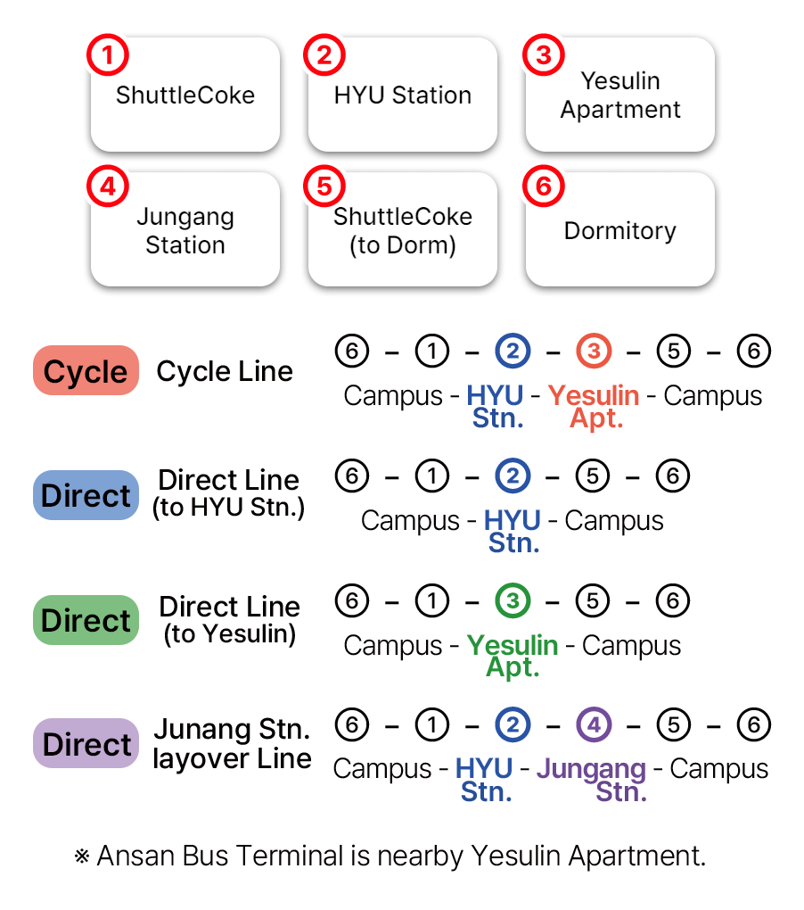

### What is this?

BusHanyang is a shuttle bus timetable service for Hanyang University ERICA students.

The timetable is based on the PDF uploaded in the school official homepage.

Now, there is no need to check PDF everytime, nor check for any announcements about the shuttle bus.

### Route Information

### How to use

For the best user experience, please use Chrome in Android, and Safari for iPhone users.

- [https://hybus.app](https://hybus.app) Access this page via link (Current Page)

Android: Click `Add BusHanyang to Home Screen` banner in the bottom of the browser. If there is no such banner, click the 3-dot at the right-top of the Chrome browser and click `Add to Home Screen`.

iPhone: From Safari, click the share button below, and click `Add to Home Screen`.

This way, users can now use this service like an app even though it is a web service.

### Additional Information

We have BusHanyang widgets for iOS. However, English is not currently supported yet. This may be updated in the future.